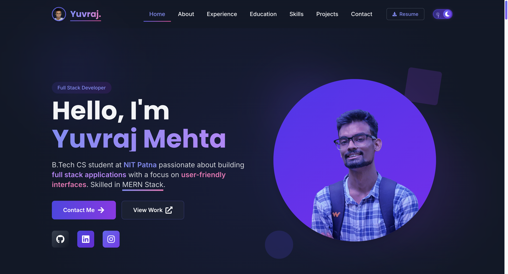

# Modern Developer Portfolio


A modern, responsive portfolio website built with React, TypeScript, and Vite, designed to showcase my skills as a full stack developer with expertise in data structures and algorithms and a growing knowledge of Generative AI.



## 🚀 Features

- **Responsive Design** - Optimized for all device sizes from mobile to desktop
- **Dark/Light Mode** - Theme toggle with context API for state management
- **Modern UI/UX** - Clean, professional interface with engaging animations
- **Interactive Elements** - Hover effects, transitions, and scroll animations
- **Fast Performance** - Built with Vite for lightning-fast load times
- **TypeScript Integration** - Type-safe code for improved development experience
- **Component-Based Architecture** - Modular, reusable components
- **SEO Optimization** - Meta tags and structured data for better search visibility
- **Accessibility** - WCAG compliant design for all users

## 📋 Sections

- **Hero** - Dynamic introduction with animated elements and call-to-action
- **About Me** - Professional background and journey with animated timeline
- **Work Experience** - Detailed work history with company information
- **Education** - Academic background and certifications
- **Coding Skills** - DSA problem-solving statistics from platforms like LeetCode
- **Tech Stack** - Comprehensive display of technical skills by category
- **Projects** - Interactive showcase of key projects with details and live links
- **Contact** - Form and direct contact options with social media links

## 🔧 Technology Stack

- **Frontend Framework**: React 18 with TypeScript
- **Build Tool**: Vite
- **CSS Framework**: Tailwind CSS
- **Animations**: Framer Motion
- **Icons**: React Icons
- **Responsive Design**: Custom hooks with Intersection Observer
- **State Management**: React Context API
- **Deployment**: Vercel

## 🛠️ Installation & Setup

1. **Clone the repository**

```bash
git clone https://github.com/yuvraj-mehta/Portfolio.git
cd Portfolio
```

2. **Install dependencies**

```bash
npm install
```

3. **Run development server**

```bash
npm run dev
```

4. **Build for production**

```bash
npm run build
```

5. **Preview production build**

```bash
npm run preview
```

## 💻 Development Approach

- **Atomic Design Methodology** - Building from small components to larger sections
- **Mobile-First Development** - Designing for mobile devices first, then scaling up
- **BEM CSS Naming Convention** - Ensuring CSS class naming consistency
- **Clean Code Practices** - Following established patterns and best practices
- **Performance Optimization** - Minimizing bundle size and optimizing rendering
- **Progressive Enhancement** - Ensuring basic functionality across all devices
- **Continuous Refactoring** - Regular code reviews and improvements

## 🌟 Key Features Implementation

### Dynamic Theme Switching

The portfolio uses React Context API to implement a seamless dark/light mode toggle that persists user preferences in local storage.

### Interactive Animations

Strategic use of Framer Motion for scroll-triggered animations that enhance user experience without compromising performance.

### Responsive Design System

Custom responsive design system using Tailwind CSS with carefully crafted breakpoints for all device sizes.

### Optimized Assets

All images are optimized and properly sized with lazy loading to improve initial load time and Core Web Vitals.

### SEO Optimization

Comprehensive meta tags implementation using React Helmet Async for better search engine visibility.

## 📝 Project Structure

```
Portfolio/
├── public/                      # Static assets and favicon
│   ├── icons/                   # Technology icons (CSS, Docker, HTML, etc.)
│   ├── projectImages/           # Project screenshots and previews
│   └── Yuvraj_Resume_v2_1.pdf   # Downloadable resume
├── src/
│   ├── assets/                  # Images, fonts, and other media
│   │   └── grid-pattern.svg     # Background pattern asset
│   ├── components/              # React components for each section
│   │   ├── AboutSection.tsx     # About me section
│   │   ├── ContactSection.tsx   # Contact information and form
│   │   ├── CodingSkillsSection.tsx # Coding skills showcase
│   │   ├── DSAStatsCounter.tsx  # Data structures & algorithms statistics
│   │   ├── EducationSection.tsx # Education and certifications
│   │   ├── HeroSection.tsx      # Hero section with animations
│   │   ├── NavigationBar.tsx    # Navigation with mobile responsiveness
│   │   ├── PageFooter.tsx       # Footer with social links
│   │   ├── ProjectsSection.tsx  # Projects showcase with details
│   │   ├── SectionContainer.tsx # Reusable section wrapper
│   │   ├── SEO.tsx              # SEO component for meta tags
│   │   ├── TechStackSection.tsx # Technology skills by category
│   │   ├── ThemeSwitcher.tsx    # Dark/light mode toggle
│   │   └── WorkExperienceSection.tsx # Work history and experience
│   ├── contexts/                # React context providers
│   │   └── ThemeContext.tsx     # Theme management for dark/light mode
│   ├── data/                    # Static content and configuration
│   │   └── seo.ts               # SEO data configuration
│   ├── styles/                  # Global styles and custom CSS
│   │   ├── backgroundStyles.css # Background styling
│   │   ├── codeAnimations.css   # Code animation effects
│   │   ├── custom.css           # Custom styling
│   │   └── iconAnimations.css   # Icon animation effects
│   ├── App.tsx                  # Main application component
│   ├── main.tsx                 # Entry point with providers
│   └── vite-env.d.ts            # Vite type declarations
├── eslint.config.js             # ESLint configuration
├── DOCUMENTATION.md             # Project documentation
├── index.html                   # HTML entry point
├── package.json                 # Project dependencies and scripts
├── tailwind.config.js           # Tailwind CSS configuration
├── tsconfig.json                # TypeScript configuration
├── tsconfig.node.json           # TypeScript configuration for Node
├── vercel.json                  # Vercel deployment configuration
├── vite.config.ts               # Vite configuration
└── README.md                    # Project readme
```

## 🔜 Upcoming Features

- **Individual Project Pages** - Dedicated pages with in-depth information about each project
- **Real-time Coding Stats** - Live integration with competitive programming platforms showing solved problems and ratings (already started with DSACounter component)
- **Dark/Light Mode** - Theme toggle for user preference (implementation in progress with ThemeContext)

## 🤝 Contributing

Contributions are welcome! Please feel free to submit a Pull Request.

1. Fork the repository
2. Create a feature branch (`git checkout -b feature/amazing-feature`)
3. Commit your changes (`git commit -m 'Add some amazing feature'`)
4. Push to the branch (`git push origin feature/amazing-feature`)
5. Open a Pull Request

## 📄 License

This project is licensed under the MIT License - see the [LICENSE](LICENSE) file for details.

## 📞 Contact

Yuvraj Mehta - [yuvraj.mehta532@gmail.com](mailto:yuvraj.mehta532@gmail.com)

Project Link: [https://github.com/yuvraj-mehta/Portfolio](https://github.com/yuvraj-mehta/Portfolio)

---

⭐️ From [yuvraj-mehta](https://github.com/yuvraj-mehta)

## 🔮 Future Improvements

- **Advanced Analytics** - Implement detailed visitor analytics
- **API Integration** - Live GitHub contribution stats and project updates
- **Animation Enhancements** - More advanced scroll-triggered animations
- **Performance Monitoring** - Integration with performance monitoring services

## 📄 License

This project is licensed under the MIT License - see the LICENSE file for details.

## 🙏 Acknowledgements

- React and TypeScript communities for excellent documentation
- Framer Motion for the powerful animation library
- Tailwind CSS for the utility-first CSS framework
- Vercel for seamless deployment

---

© 2025 Yuvraj Mehta. All rights reserved.