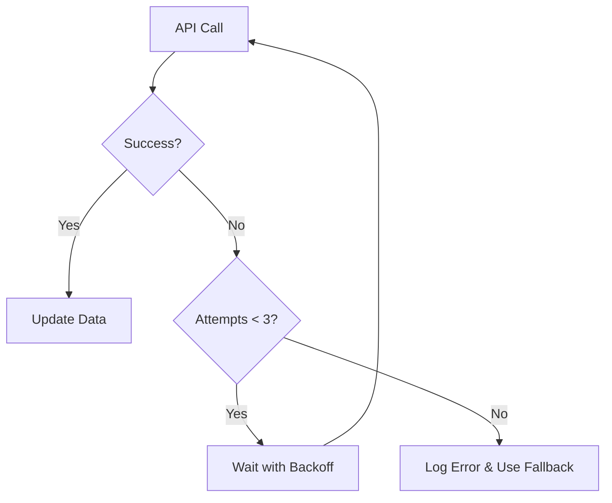

# API Retry Mechanism Documentation

## Overview

The client-side API retry mechanism has been implemented to handle API failures gracefully by automatically retrying failed requests up to **3 times maximum** before giving up. This ensures better reliability when fetching coding platform data.

## Implementation Details

### Core Components

#### 1. `apiRetry.ts` Utility Module

Located at: `client/src/utils/apiRetry.ts`

**Key Features:**

- **Maximum Retry Attempts**: 3 attempts (configurable)
- **Exponential Backoff**: Increasing delay between retries (1s, 1.5s, 2.25s)
- **Error Handling**: Comprehensive error logging and reporting
- **Type Safety**: Full TypeScript support

**Functions:**

```typescript
// Generic retry function for any async operation
retryApiCall<T>(fn: () => Promise<T>, options?: RetryOptions): Promise<T>

// Specific fetch wrapper with retry logic
fetchWithRetry(url: string, options?: RequestInit, retryOptions?: RetryOptions): Promise<Response>
```

**Configuration Options:**

```typescript
interface RetryOptions {
  maxAttempts?: number; // Default: 3
  delayMs?: number; // Default: 1000ms
  backoffMultiplier?: number; // Default: 1.5
}
```

#### 2. Updated Hooks

All coding platform hooks have been updated to use the retry mechanism:

- `useLeetCodeData.ts`
- `useCodeChefData.ts`
- `useCodeforcesData.ts`
- `useGfgData.ts`

## Retry Behavior

### Attempt Pattern

1. **First Attempt**: Immediate API call
2. **Second Attempt**: 1 second delay if first fails
3. **Third Attempt**: 1.5 seconds delay if second fails
4. **Failure**: Use fallback data after all attempts exhausted

### Error Handling Flow



### Logging

The retry mechanism provides detailed console logging:

```javascript
// Success after retry
"API call succeeded on attempt 2";

// Retry attempt
"API call failed on attempt 1/3: [Error Details]";
"Retrying in 1000ms...";

// Final failure
"Failed to fetch [Platform] data after all retry attempts: [Error Details]";
```

## Benefits

### 1. **Improved Reliability**

- Handles temporary network issues
- Reduces impact of server-side temporary failures
- Better user experience with automatic recovery

### 2. **Controlled Resource Usage**

- Maximum of 3 attempts prevents infinite loops
- Exponential backoff reduces server load
- Graceful degradation to fallback data

### 3. **Transparent Operation**

- No user interface changes required
- Fallback data ensures UI never breaks
- Detailed logging for debugging

### 4. **Configurable**

- Easy to adjust retry parameters
- Can be customized per platform if needed
- Future-proof architecture

## Usage Examples

### Basic Usage (Automatic)

```typescript
// The hooks now automatically handle retries
useLeetCodeData(fallbackData, updateCallback);
```

### Custom Configuration (If Needed)

```typescript
// Custom retry options
const customOptions = {
  maxAttempts: 2,
  delayMs: 500,
  backoffMultiplier: 2.0,
};

const response = await fetchWithRetry(url, fetchOptions, customOptions);
```

## Error Scenarios Handled

1. **Network Connectivity Issues**

   - Temporary internet disconnection
   - DNS resolution failures
   - Connection timeouts

2. **Server-Side Issues**

   - 500 Internal Server Error
   - 502 Bad Gateway
   - 503 Service Unavailable
   - Temporary API rate limiting

3. **Response Issues**
   - Malformed JSON responses
   - HTTP error status codes
   - Incomplete responses

## Fallback Strategy

When all retry attempts fail:

1. **Error Logging**: Detailed error information logged to console
2. **Fallback Data**: Component continues using static fallback data
3. **User Experience**: No visible errors or broken UI elements
4. **Graceful Degradation**: Portfolio remains fully functional

## Performance Impact

### Network Usage

- **Maximum Requests**: 3 per platform (12 total for all platforms)
- **Backoff Delays**: Prevent server overload
- **Timeout Handling**: Built-in request timeouts

### Memory Usage

- **Minimal Overhead**: Lightweight retry logic
- **No Memory Leaks**: Proper cleanup of timeouts and promises
- **Error Object Management**: Efficient error handling

## Monitoring and Debugging

### Console Logs

```javascript
// Monitor retry attempts
console.warn("API call failed on attempt 1/3:", error);

// Track successful retries
console.log("API call succeeded on attempt 2");

// Monitor final failures
console.error("Failed to fetch LeetCode data after all retry attempts:", error);
```

### Debugging Tips

1. **Check Network Tab**: Monitor actual HTTP requests in browser dev tools
2. **Console Logs**: Review retry patterns and error messages
3. **Fallback Verification**: Ensure fallback data is being used when APIs fail
4. **Performance**: Monitor for excessive retry attempts

## Future Enhancements

### Potential Improvements

1. **Circuit Breaker Pattern**: Temporarily disable retries for consistently failing endpoints
2. **Jitter**: Add randomization to retry delays to prevent thundering herd
3. **Retry Policies**: Different retry strategies per platform based on their reliability
4. **Metrics Collection**: Track retry success rates and failure patterns
5. **User Notifications**: Optional user feedback for persistent failures

### Configuration Extensions

```typescript
// Future enhancement possibilities
interface AdvancedRetryOptions {
  circuitBreaker?: boolean;
  jitter?: boolean;
  retryOn?: (error: Error) => boolean;
  onRetry?: (attempt: number, error: Error) => void;
}
```

## Testing

### Manual Testing

1. **Network Disconnect**: Test with temporary network disconnection
2. **Server Simulation**: Use browser dev tools to simulate server errors
3. **Console Monitoring**: Verify retry behavior through console logs

### Automated Testing

- Unit tests for retry utility functions
- Integration tests for hook behavior
- End-to-end tests for complete failure scenarios

## Conclusion

The implemented retry mechanism provides robust error handling for API calls while maintaining a limit of **3 maximum attempts** per request. This ensures better reliability without overwhelming the server or degrading performance. The solution is transparent to users and maintains the portfolio's functionality even when APIs are temporarily unavailable.
